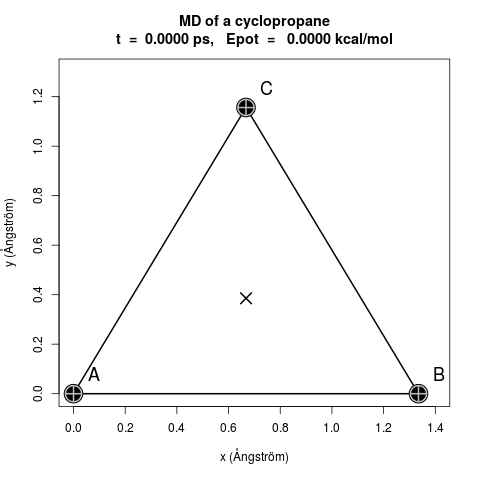
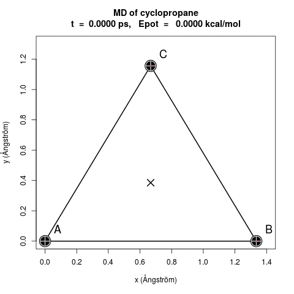
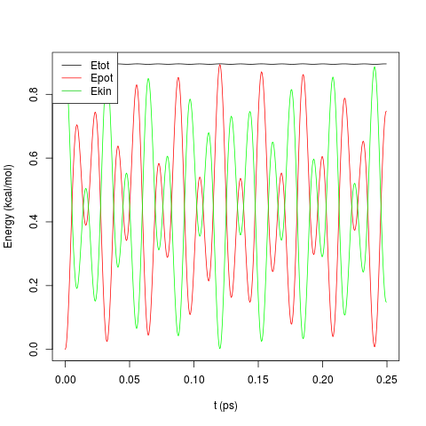

# Molecular dynamics of a cyclopropane
Structural bioinformatics project<br />
Read the report in french for more details

### Prerequisites
UNIX/shell environment<br />
Python3, Rscript

### Running the MD
* Force calculated using an **analytical derivative** :
```
$ python3 scripts/MD_cyclopropane_1.py
```
* Force calculated using a **numerical derivative** :
```
$ python3 scripts/MD_cyclopropane_2.py
```

The file results/MD_cyclopropane.dat is created.

### Plotting the results (Animation and Energies plots) :
```
$ Rscript scripts/MD_cyclopropane.R
```
The following files are generated :

<p align="center">
  
</p>

<p align="center">
  
</p>

<p align="center">
  
</p>


### Authors
Bioinformatics master student (University of Paris Diderot) :
* **Hélène Kabbech**
* **Madeleine De Sousa Violente**
